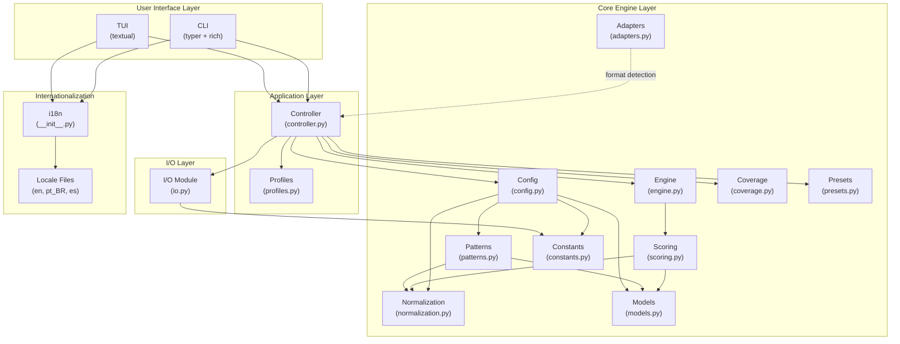
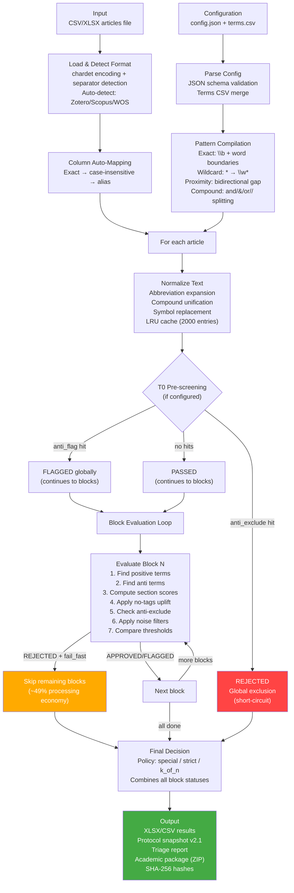
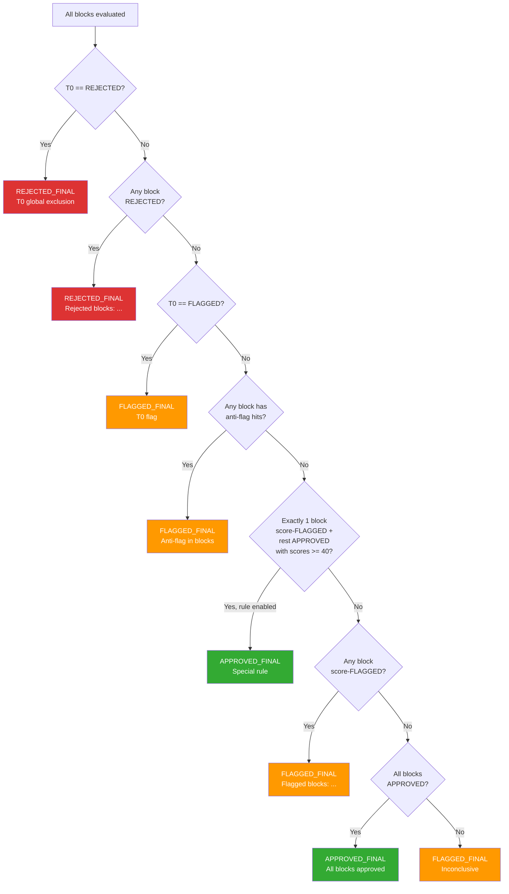

# FastSLR v3.0.0 — Technical Report

> **Document type:** Technical-executive reference
> **Audience:** Thesis committee, peer reviewers, developers
> **Version:** 3.0.0
> **Date:** March 2026

---

## Table of Contents

1. [Executive Summary](#1-executive-summary)
2. [System Architecture](#2-system-architecture)
3. [Pipeline](#3-pipeline)
4. [Algorithm](#4-algorithm)
5. [Configuration System](#5-configuration-system)
6. [Reproducibility and Audit Trail](#6-reproducibility-and-audit-trail)
7. [Quality Assurance](#7-quality-assurance)
8. [Interfaces](#8-interfaces)
- [Appendix A: Default Configuration Reference](#appendix-a-default-configuration-reference)
- [Appendix B: Complete Module API Reference](#appendix-b-complete-module-api-reference)
- [Appendix C: Decision Tree](#appendix-c-decision-tree)

---

## 1. Executive Summary

### 1.1 Problem Statement

Manual screening in Systematic Literature Reviews (SLRs) is slow, irreproducible, and subjective. A typical SLR involves hundreds to thousands of candidate articles that must be assessed against inclusion and exclusion criteria. When performed manually, this process suffers from inter-reviewer disagreement, fatigue-induced errors, and an inability to guarantee that two reviewers applying the same criteria to the same corpus will produce identical results.

### 1.2 Solution

FastSLR is a **deterministic triage engine** for SLR screening based on configurable, multi-block pattern matching. It evaluates each article's title, abstract, and manual tags against a structured set of search terms organized into thematic domain blocks, computes weighted relevance scores, and produces a final decision (APPROVED, FLAGGED, or REJECTED) through a transparent, auditable decision tree.

### 1.3 Design Philosophy: No AI/ML

FastSLR makes a **conscious, deliberate design decision** to use zero AI or ML components. This is not a limitation — it is a trade-off that yields three critical properties for academic research:

- **Transparency:** Every decision can be traced to specific term matches, section scores, and threshold comparisons. There are no opaque model weights or stochastic inference steps.
- **Determinism:** Given identical inputs (articles, configuration, terms), the engine produces bit-for-bit identical outputs every time, on any platform, without exception.
- **Full reproducibility:** Any researcher can reproduce the exact results by using the same configuration files and input data. The protocol snapshot captures everything needed.

### 1.4 Demonstrated Results

FastSLR was validated on a real SLR studying *Artificial Intelligence in Oil & Gas Supply Chain Management* (Protocol v12, January 2026):

| Metric | Value |
|--------|-------|
| Articles processed | 505 unique (from 2,519 raw hits across 4 databases) |
| Processing time | 6.91 seconds |
| Processing rate | 73.0 articles/second |
| Final corpus | 38 articles (7.5% inclusion rate) |
| APPROVED_FINAL | 43 (8.5%) |
| FLAGGED_FINAL | 147 (29.1%) |
| REJECTED_FINAL | 315 (62.4%) |
| Fail-fast economy | ~49% of articles did not require full block evaluation |
| Domain blocks | 3 (T1A: Oil & Gas, T1B: AI, T1C: SCM) |
| Configuration hash | `bf5ca7e87477fe92` |

The funnel from 505 articles to 38 final corpus entries (7.5% inclusion rate) falls within the expected range for SLRs with rigorous eligibility criteria and triple-domain intersection, confirming the precision and specificity of the triage protocol.

### 1.5 Key Numbers at a Glance

| Feature | Count |
|---------|-------|
| Dynamic domain blocks | N (user-configurable, typically 2-5) |
| Relevance levels | 5 (standard preset; also supports 1 or 3) |
| Decision policies | 3 (special, strict, k_of_n) |
| Interface languages | 3 (English, Portuguese BR, Spanish) |
| CLI commands | 10 |
| TUI screens | 10 |
| Level presets | 3 (binary, simple, standard) |
| Noise filter profiles | 3 (relaxed, balanced, strict) |

---

## 2. System Architecture

### 2.1 Layer Diagram



**Design principle:** Neither CLI nor TUI imports from `core/` directly. All orchestration passes through `controller.py`, which is the single point of contact between the application layer and the core engine. This ensures that both interfaces share identical logic and that the core engine remains interface-agnostic.

### 2.2 Module Map

| Module | File | Lines | Responsibility |
|--------|------|------:|----------------|
| `scoring` | `core/scoring.py` | 548 | Term matching, block evaluation, T0 pre-screening, final decision tree |
| `engine` | `core/engine.py` | 324 | Article processing pipeline, statistics collection, column auto-mapping |
| `patterns` | `core/patterns.py` | 245 | Pattern compilation (exact, wildcard, proximity), compound term detection |
| `normalization` | `core/normalization.py` | 128 | Text normalization engine with LRU cache (abbreviations, compounds, symbols) |
| `models` | `core/models.py` | 194 | Data classes: `GlobalParams`, `BlockEvaluation`, `T0Evaluation`, `TermMatch`, `AntiHit` |
| `config` | `core/config.py` | 333 | Config loading, JSON schema validation, terms CSV parsing, parameter construction |
| `io` | `core/io.py` | 746 | CSV/XLSX I/O, export, highlighting, reports, protocol snapshots, academic packages |
| `adapters` | `core/adapters.py` | 184 | Bibliographic format detection (Zotero, Scopus, WOS) and column mapping |
| `coverage` | `core/coverage.py` | 243 | Term coverage analysis: dead terms, broad terms, block discrimination |
| `constants` | `core/constants.py` | 64 | Version, default thresholds, valid values, section names |
| `presets` | `core/presets.py` | 160 | Level presets (binary/simple/standard), config generation |
| `cli` | `app/cli.py` | 439 | 10 CLI commands via typer with rich output |
| `tui` | `app/tui.py` | 870 | 10 interactive TUI screens via textual |
| `controller` | `app/controller.py` | 679 | Orchestration: run_triage, preview, coverage, diff, project creation, export |
| `profiles` | `app/profiles.py` | 110 | Profile save/load/list/delete (~/.fastslr/profiles/) |
| `i18n` | `i18n/__init__.py` | 130 | Locale detection, JSON-based translation, fallback chain |
| **Total** | | **5,397** | |

### 2.3 Technology Stack

| Dependency | Version | Purpose | Rationale |
|------------|---------|---------|-----------|
| **Python** | >= 3.10 | Runtime | Requires `match` statements, `X \| Y` union types, `ParamSpec`. Python 3.10 is the oldest version still receiving security updates as of 2026. |
| **pandas** | >= 2.0 | Data manipulation | Industry-standard DataFrame library. Handles CSV/XLSX I/O, column operations, and statistics efficiently. Essential for the tabular article data model. |
| **openpyxl** | >= 3.1 | XLSX export | Required by pandas for `.xlsx` write support. Chosen over `xlsxwriter` for read+write capability. |
| **typer** | >= 0.12 | CLI framework | Modern CLI framework built on click. Provides type-annotated commands, automatic `--help`, and shell completion with minimal boilerplate. |
| **rich** | >= 13.0 | Terminal formatting | Powers progress bars, styled tables, and colored output in the CLI. Dependency of both typer and textual. |
| **textual** | >= 0.80 | TUI framework | CSS-styled terminal UI framework. Supports DataTables, Input fields, RadioSets, and threaded background work — essential for the 10-screen interactive interface. |
| **jsonschema** | >= 4.20 | Config validation | Validates configuration files against the bundled JSON Schema at load time. Catches errors before processing. |
| **chardet** | >= 5.0 *(optional)* | Encoding detection | Detects CSV file encoding automatically. Gracefully degrades to UTF-8 when not installed. |

**Development dependencies** (not required at runtime): `pytest`, `pytest-cov`, `ruff`, `pyright`, `coverage`.

### 2.4 Design Decisions

The following 12 design decisions were made during the v3.0.0 development and are recorded in the project decision log:

| # | Decision | Alternatives Considered | Rationale |
|---|----------|------------------------|-----------|
| 1 | **Remove all AI/ML components** | Keep as optional, move to separate repo | System must be 100% mechanical for academic publication. Determinism and transparency are non-negotiable. Git history preserves the removed code. |
| 2 | **Dual interaction model (CLI + TUI)** | Batch only (legacy), TUI only | Researchers have different preferences. CLI enables scripting and reproducibility; TUI enables guided use for non-programmers. |
| 3 | **Hybrid architecture (v2.0 engine + new shell)** | Incremental refactor, full rewrite | The engine is tested and correct. Risk resides in the application shell, not the algorithm. Clear layer separation enables independent evolution. |
| 4 | **English interface with i18n** | English only, full i18n including output | International audience needs translated interface. Output data stays English to ensure reproducibility across locales. |
| 5 | **All 10 TUI screens** | Subset / phased release | Complete tool for publication. Each screen serves a distinct research workflow need. |
| 6 | **Cross-platform distribution via pip** | Windows-only `.bat` (legacy), conda, Docker | `pip install fastslr` is the most accessible distribution for academia. Python >= 3.10 on Windows/macOS/Linux. |
| 7 | **Pragmatic dependencies** | Minimal (stdlib only), heavy (Django/Flask) | pandas, openpyxl, typer, rich, textual are established libraries with reasonable install size and good cross-platform support. |
| 8 | **MIT License** | Apache 2.0, GPL v3 | Most permissive, standard in academic tools, minimizes adoption barriers for research use. |
| 9 | **UX designed for non-programmers** | Developer-focused CLI | Target users are researchers from diverse fields (management, engineering, health sciences), most of whom are not programmers. TUI uses plain language, contextual help, and friendly errors. |
| 10 | **Version 3.0.0** | v2.1, v2.5 | Breaking changes: removed AI layer, new application shell, restructured modules. Warrants a major version bump per semver. |
| 11 | **Pyright standard + ruff + stress tests** | Basic testing only | Academic publication demands robustness. Pyright standard mode catches type errors. Ruff enforces consistent formatting and linting. Stress tests with an auditable log document resilience. |
| 12 | **Remove legacy/ directory** | Keep as reference | Superseded by the universal v2.0-to-v3.0 engine. Git history preserves it for archaeology. |

---

## 3. Pipeline

### 3.1 End-to-End Flowchart



### 3.2 Input Stage

#### Supported Formats

FastSLR accepts CSV and XLSX files. The minimum required columns are an identifier, a title, and an abstract. Manual tags are optional but improve scoring accuracy.

#### Auto-Detection of Bibliographic Formats

The `adapters.py` module detects the export format by matching DataFrame column names against known signature sets:

| Format | Signature Columns | Column Mapping |
|--------|-------------------|----------------|
| **Zotero** | `Key`, `Item Type`, `Abstract Note`, `Manual Tags` | id=`Key`, title=`Title`, abstract=`Abstract Note`, tags=`Manual Tags` |
| **Scopus** | `EID`, `Source title`, `Cited by`, `Abstract` | id=`EID`, title=`Title`, abstract=`Abstract`, tags=`Author Keywords` |
| **Web of Science** | `UT`, `TI`, `AB`, `SO` | id=`UT`, title=`TI`, abstract=`AB`, tags=`DE` |

Detection requires at least 2 matching signature columns. The format with the most overlapping columns wins.

#### Encoding Detection

When the optional `chardet` package is installed, the first 10,000 bytes of the input file are sampled to detect encoding. Without `chardet`, UTF-8 is assumed. Separator detection tries semicolon, comma, and tab in order, accepting the first result that produces at least 3 columns.

#### Column Auto-Mapping

The engine resolves configured column names to actual DataFrame columns through a three-step fallback:

1. **Exact match** — the configured name exists as-is in the DataFrame
2. **Case-insensitive match** — e.g., `"title"` matches `"Title"`
3. **Known aliases** — e.g., `"abstract"` maps to `"Abstract Note"` (Zotero)

Built-in aliases:

| Internal name | Known aliases |
|--------------|---------------|
| `key` | `Key`, `key`, `ID`, `id` |
| `title` | `Title`, `title` |
| `abstract` | `Abstract Note`, `abstract`, `Abstract` |
| `manual_tags` | `Manual Tags`, `manual_tags`, `Tags` |

### 3.3 Pre-processing: Normalization

The `NormalizationEngine` applies a deterministic sequence of text transformations:

1. **Abbreviation expansion** — word-boundary replacement of known abbreviations (e.g., `"AI"` → `"artificial intelligence"`)
2. **Lowercasing** — after abbreviation expansion to preserve case-sensitive abbreviation matching
3. **Symbol replacement** — character-level substitutions (e.g., `"&"` → `"and"`). Alphanumeric symbols use word boundaries; punctuation symbols use literal replacement.
4. **Compound variant unification** — word-boundary replacement of compound variants to canonical forms (e.g., `"supply-chain"` → `"supply chain"`)
5. **Whitespace collapse** — all runs of whitespace reduced to a single space, trimmed

**LRU Cache:** Each `NormalizationEngine` instance maintains an LRU cache of 2,000 entries. Since many articles share similar text patterns (especially in tags), caching avoids redundant regex operations. The cache is keyed on the raw input string and evicts the oldest entry when full.

**Normalization rules** can be defined in the terms CSV via `normalization_type` and `normalization_target` columns. Supported types: `abbreviation`, `compound_variant`, `symbol_replacement`. Rules are extracted by `extract_normalization_rules()` and activated automatically when at least one rule is found (`enabled = True`).

When normalization is disabled (no rules provided), the fallback is simple lowercasing and whitespace collapse.

### 3.4 Processing Stage

#### Article Loop

The `process_articles()` function iterates over every row in the input DataFrame. For each article:

1. Extract and clean `id`, `title`, `abstract`, and `manual_tags` fields (handling `NaN`, `None`, `null` values)
2. Run T0 global pre-screening
3. If T0 rejects, mark all domain blocks as `NOT_EVALUATED` (reason: "Global T0 exclusion")
4. Otherwise, evaluate each domain block sequentially
5. Compute the final decision via `make_final_decision()`
6. Build the output row with highlighted text, per-block scores, and the verdict

#### Fail-Fast Behavior

When `FAIL_FAST_GLOBAL` is `true` (default), if any domain block returns `REJECTED`, all subsequent blocks are marked `NOT_EVALUATED` with reason "Previous block rejected". This is methodologically sound because all domain blocks are mandatory by design — if an article fails any block, it cannot pass the overall triage.

**Measured impact:** In the demonstrated real-world SLR (505 articles, 3 blocks), fail-fast produced ~49% processing economy:
- 36.6% of articles were rejected at T1A (first block) — T1B and T1C skipped
- 37.0% of articles were `NOT_EVALUATED` at T1B (fail-fast from T1A)
- 49.1% of articles were `NOT_EVALUATED` at T1C (cumulative fail-fast)

#### Error Policies

| Policy | Behavior |
|--------|----------|
| `flag` (default) | Processing errors are caught per-article. The article is marked `FLAGGED_FINAL` with reason `"Processing error: {details}"`. Processing continues. |
| `fail` | The first processing error raises an exception, halting the entire run. |

The `MAX_ERROR_RATE` parameter (default: 0.05) provides an additional safeguard but is checked at the application layer.

### 3.5 Output Stage

#### Exported Artifacts

A full triage run produces the following artifacts in the output directory:

| Artifact | Format | Contents |
|----------|--------|----------|
| `triage_results.xlsx` | XLSX | One row per article: ID, highlighted title/abstract/tags, per-block raw scores, final scores, best levels, statuses, highlight details, anti-highlights, flags, final decision, reason, version, timestamp |
| `triage_report.txt` | Text | Human-readable summary: version, date, total articles, processing time, rate, config hash, decision distribution, per-block performance |
| `protocol.json` | JSON | Protocol snapshot v2.1 (see Section 6.1) |
| `academic_report.md` | Markdown | Academic compliance report: configuration summary, scoring criteria, processing metrics, input hashes |
| `config_audit.json` | JSON | Sanitized configuration (compiled patterns stripped) with metadata |
| `academic_package.zip` | ZIP | All above artifacts + `APPENDIX_INDEX.md` + `appendix_manifest.json` |

#### Protocol Snapshot v2.1

The protocol snapshot captures all information needed to reproduce a run:
- Schema: `rsl-triage-protocol-v2.1`
- Input file paths and SHA-256 hashes (truncated to 16 hex chars)
- Configuration hash
- Decision policy and domain block definitions
- Level scores, section weights, approval/flagging thresholds
- Processing metrics (total articles, time, rate)
- Artifact paths
- Deterministic engine flag: `true`

#### SHA-256 Hashes

File hashes are computed using SHA-256 with 8 KiB chunked reading, truncated to 16 hexadecimal characters. Configuration hashes are computed by serializing the sanitized config dict with sorted keys and compact separators.

---

## 4. Algorithm

### 4.1 Term Matching Engine

#### Exact Matching

Non-regex terms are compiled with word boundaries (`\b`) to prevent partial matches. The process:

1. Strip whitespace from the raw term
2. Escape all regex metacharacters via `re.escape()`
3. Restore wildcards: `\*` (escaped asterisk) → `\w*` (match word characters)
4. Wrap with word boundaries: `\b{escaped}\b`
5. Compile with `re.IGNORECASE`

**Example:** Term `"industr*"` becomes regex `\bindustr\w*\b`, matching "industry", "industries", "industrial", etc.

#### Wildcard Support

The `*` character in terms is treated as a wildcard matching zero or more word characters (`\w*`). This is the standard truncation convention used in bibliographic database searches and provides familiar behavior for researchers.

#### Proximity Detection

Compound terms connected by `and`, `&`, `or`, or `/` are detected by the regex:

```
^(.+?)\s+(?:and|&|or)\s+(.+)$|^(.+?)\s*/\s*(.+)$
```

For each detected compound (e.g., `"supply and demand"`), a bidirectional proximity pattern is generated:

```
\b{term_a}{gap}{term_b}\b | \b{term_b}{gap}{term_a}\b
```

Where `{gap}` = `(?:\s+\S+){0,max_gap}\s+` — allowing up to `max_gap` intervening tokens (default: 2) between the two terms, in either order.

**Parameters:**
- `MAX_GAP_BETWEEN_TERMS`: Maximum intervening tokens (default: 2)
- `TOKEN_UNIT_FOR_GAPS`: Regex defining one token (default: `\S+`)
- `ENABLE_PROXIMITY_DETECTION`: Master switch (default: `true`)

#### Pattern Compilation and Caching

All patterns are compiled once during configuration preparation (`precompile_patterns()`) and stored in the block configuration dict. This avoids recompilation during the article processing loop. The compilation step:

1. Iterates over `positives`, `anti.exclude`, and `anti.flag` entries
2. Compiles each term via `compile_pattern()` — returns `None` for invalid patterns (logged, skipped)
3. For each compiled positive, calls `detect_compound_terms()` to find `and`/`&`/`or`/`/` connectors
4. Generates proximity patterns via `compile_proximity_pattern()` for each compound pair
5. Stores proximity patterns in a separate `proximity_positives` list

### 4.2 T0 Global Pre-screening

T0 is a global gate that runs **before** any domain block evaluation. It uses only anti-terms (no positive terms or scoring).

**Purpose:** Remove articles that match global exclusion criteria (e.g., "systematic review" — a secondary study that should not be included when searching for primary studies) or flag articles that match global warning criteria, before investing computational effort in per-block evaluation.

**Logic:**

```
if T0 anti_exclude matches → REJECTED (short-circuit: no blocks evaluated)
if T0 anti_flag matches   → FLAGGED (blocks still evaluated, but final decision capped)
if no T0 hits             → PASSED (blocks evaluated normally)
```

T0 is optional. If no `T0` key exists in the configuration, T0 evaluation returns `None` and blocks are evaluated directly.

### 4.3 Block Evaluation

Each domain block is evaluated independently by `evaluate_block()`. The scoring formula is explicit and deterministic:

#### Step 1: Find Positive Terms

For each term (exact + proximity) against each section (title, abstract, manual_tags):
- If `scope` is `"any"`, search all three sections
- If `scope` is a specific section name, search only that section
- Record the term, level, section, match type, and source row for every hit

#### Step 2: Compute Section Scores

```
For each section in (title, abstract, manual_tags):
    unique_levels = {m.level for m in section_matches}
    section_raw   = sum(level_scores[L] for L in unique_levels)
    section_raw   = min(section_raw, MAX_SECTION_SCORE)        # cap at 30
    weighted      = section_raw * section_weight
```

**Critical detail:** Scoring is based on **unique levels found per section**, not individual match count. If 5 different terms all match at level 3, the level-3 score (6 points) is counted only once. This prevents term list inflation from distorting scores.

**Default level scores:**

| Level | Points | Semantic meaning |
|-------|--------|-----------------|
| 1 | 10 | Essential / exact match to the research question |
| 2 | 8 | Directly related |
| 3 | 6 | Research focus |
| 4 | 4 | Processes / methods |
| 5 | 2 | Broad context |

**Default section weights:**

| Section | Weight | Rationale |
|---------|--------|-----------|
| `title` | 2.0 | Title terms are strongest relevance signals |
| `abstract` | 1.0 | Baseline weight |
| `manual_tags` | 1.5 | Author-assigned keywords are strong signals |

**Section score cap:** `MAX_SECTION_SCORE = 30` — prevents any single section from dominating the total score even when many levels are matched.

#### Step 3: Compute Raw Score

```
raw_score = sum(weighted_score for all sections)
          = (title_section_raw * 2.0) + (abstract_section_raw * 1.0) + (tags_section_raw * 1.5)
```

#### Step 4: Apply No-Tags Uplift

```
if manual_tags is empty AND NO_TAGS_UPLIFT > 1.0 AND raw_score > 0:
    final_score = raw_score * NO_TAGS_UPLIFT    # default: 1.17
else:
    final_score = raw_score
```

**Rationale:** Articles without manual tags miss one scoring opportunity. The 17% uplift compensates for this structural disadvantage without falsely promoting zero-relevance articles (the `raw_score > 0` guard).

Empty tags are detected by checking for empty string, or string values `"nan"`, `"none"`, `"null"` (case-insensitive).

#### Step 5: Anti-Exclusion Check

```
if any anti_exclude term matches:
    → REJECTED immediately
    reason: "Anti-exclusion: {term}"
```

Anti-exclusion is checked **after** scoring so that the score is available in the output for diagnostic purposes, but it **overrides** any positive score — a single anti-exclude hit causes immediate rejection.

#### Step 6: Noise Filters

Noise filters are active when `NOISE_PROFILE` is not `"relaxed"`. They prevent false positives from minimal or weak matches:

| Filter | Parameter | Default | Effect |
|--------|-----------|---------|--------|
| Minimum unique terms | `MIN_UNIQUE_TERMS_FOR_APPROVAL` | 1 | Reject if fewer distinct terms matched |
| Minimum sections with hits | `MIN_SECTIONS_WITH_HITS_FOR_APPROVAL` | 1 | Reject if hits appear in fewer sections |
| Require non-weak term | `REQUIRE_NON_WEAK_TERM_FOR_APPROVAL` | `false` | Reject if only weak-level terms found (default weak: level 5) |

#### Step 7: Threshold Comparison

```
if best_level has approval_threshold AND final_score >= approval_threshold:
    status = APPROVED
elif final_score >= flagging_threshold:
    status = FLAGGED
else:
    status = REJECTED
```

Where `best_level` = `min(found_levels)` (lowest number = highest priority).

**Anti-flag downgrade:** If the block would be `APPROVED` but anti-flag terms were found:

```
if anti_flag hits AND status == APPROVED:
    status = FLAGGED
    reason = "Downgraded to flagged: anti-flag term '{term}'"
```

### 4.4 Decision Thresholds

#### Approval Thresholds (default — standard preset)

| Best Level | Approval Threshold | Interpretation |
|------------|-------------------|----------------|
| 1 | 10.0 | Essential terms: low bar (high-confidence match) |
| 2 | 12.0 | Direct terms: moderate bar |
| 3 | 18.0 | Focus terms: higher bar (need more corroboration) |
| 4 | 22.0 | Process terms: high bar (low specificity) |
| 5 | `null` (None) | **No approval possible** — too generic to approve on its own |

**Why level 5 has no approval threshold:** Level 5 terms (e.g., "industry 4.0", "cost optimization") are so generic that matching them alone should never directly approve an article. They can contribute to score and trigger flagging for manual review, but approval requires at least one more specific term.

#### Flagging Thresholds (default — standard preset)

| Best Level | Flagging Threshold |
|------------|-------------------|
| 1 | 6.0 |
| 2 | 6.0 |
| 3 | 6.0 |
| 4 | 7.0 |
| 5 | 12.0 |

Level 5 requires a higher flagging threshold (12.0) to compensate for the generic nature of its terms — the article must accumulate substantial evidence from multiple sections to merit even a flag.

#### How best_level Interacts with Thresholds

The `best_level` is the **lowest** (most specific) level number among all matched terms. The approval and flagging thresholds looked up correspond to this best level. This means:

- An article matching a level-1 term needs only 10.0 points for approval
- An article matching only level-4 terms needs 22.0 points for approval
- An article matching only level-5 terms cannot be approved regardless of score

### 4.5 Final Decision Logic

The final decision combines all block evaluations and the T0 result into a single verdict. Three policies are available:

#### Policy: "special" (default)

This is the original v11 decision logic, designed for the multi-block SLR use case:



**Priority rules (evaluated in order):**

| Priority | Condition | Result |
|----------|-----------|--------|
| 1 | Any domain block has status `REJECTED` | `REJECTED_FINAL` |
| 2 | T0 == `FLAGGED` | `FLAGGED_FINAL` |
| 3 | Any block has anti-flag hits (regardless of score status) | `FLAGGED_FINAL` |
| 4 | Exactly 1 block `FLAGGED` by score (no anti-flags) + all others `APPROVED` with scores >= `SPECIAL_APPROVAL_THRESHOLD` (40.0) | `APPROVED_FINAL` (special rule) |
| 5 | Any block `FLAGGED` by score (no anti-flags) | `FLAGGED_FINAL` |
| 6 | All blocks `APPROVED` | `APPROVED_FINAL` |

**Special approval rule (Priority 4):** This rule recognizes that when one block is marginally below its approval threshold (flagged) but all other blocks show very strong approval (scores >= 40), the article is likely relevant. The rule requires `ENABLE_SPECIAL_APPROVAL_RULE = true` (default) and `SPECIAL_APPROVAL_THRESHOLD = 40.0` (default).

#### Policy: "strict"

AND logic — **all** blocks must be approved for the article to be approved:

```
if all blocks APPROVED       → APPROVED_FINAL
elif any blocks FLAGGED      → FLAGGED_FINAL
else                         → REJECTED_FINAL
```

#### Policy: "k_of_n"

Parametric — requires at least K approved blocks out of N:

```
if approved_count >= MIN_APPROVED_BLOCKS
   AND flagged_count <= MAX_FLAGGED_BLOCKS_FOR_APPROVAL:
    → APPROVED_FINAL
elif any blocks flagged or approved:
    → FLAGGED_FINAL
else:
    → REJECTED_FINAL
```

Parameters: `MIN_APPROVED_BLOCKS` (default: `null` → 1), `MAX_FLAGGED_BLOCKS_FOR_APPROVAL` (default: 0).

### 4.6 Fail-Fast: Methodological Justification

Fail-fast stops evaluating remaining blocks after the first `REJECTED` result. This is safe because under the "special" policy (and also "strict"), **any single block rejection causes final rejection**. Therefore:

- The final decision is identical with or without fail-fast
- Remaining blocks would be marked `REJECTED` or `NOT_EVALUATED` either way
- The only effect is computational: skipped blocks are marked `NOT_EVALUATED` instead of being fully scored

**Measured impact from the real SLR (505 articles, 3 blocks):**

| Block | NOT_EVALUATED count | Percentage |
|-------|--------------------|-----------|
| T1A (Context) | 2 (T0 exclusions only) | 0.4% |
| T1B (AI) | 187 | 37.0% |
| T1C (SCM) | 248 | 49.1% |

**Total processing economy:** ~49% of block evaluations were skipped. The blocks most likely to reject (Context, the most specific domain) are evaluated first via `BLOCK_ORDER`, maximizing the fail-fast benefit.

---

## 5. Configuration System

### 5.1 JSON Schema

FastSLR validates every configuration file against a bundled JSON Schema (`core/config_schema.json`) at load time via the `jsonschema` library. The schema enforces:

- **Required keys:** `global` section must exist; within it, `DECISION_POLICY`, `NOISE_PROFILE`, and `ERROR_POLICY` are mandatory.
- **Enum constraints:** `DECISION_POLICY` must be one of `"special"`, `"strict"`, `"k_of_n"`; `NOISE_PROFILE` must be `"relaxed"`, `"balanced"`, or `"strict"`; `ERROR_POLICY` must be `"flag"` or `"fail"`.
- **Numeric bounds:** `NO_TAGS_UPLIFT >= 1.0`, `MAX_SECTION_SCORE > 0`, `MAX_GAP_BETWEEN_TERMS >= 0`, `MAX_ERROR_RATE` in `[0, 1]`.
- **Pattern properties:** Level-indexed objects (scores, thresholds) accept only keys matching `^[1-9][0-9]*$`.

Validation errors produce a user-friendly message identifying the offending field path and violation. If the schema file is missing or `jsonschema` is not installed, validation is skipped with a logged warning (graceful degradation).

### 5.2 Global Parameters

The `global` section of the configuration controls all engine behavior. Every parameter is loaded by `load_global_params()` into a `GlobalParams` dataclass.

| Parameter | Type | Default | Valid Range | Effect |
|-----------|------|---------|-------------|--------|
| `DECISION_POLICY` | string | `"special"` | `special`, `strict`, `k_of_n` | How block statuses are combined into the final decision |
| `ENABLE_SPECIAL_APPROVAL_RULE` | bool | `true` | — | Allow promotion when 1 block is flagged + others strongly approved |
| `SPECIAL_APPROVAL_THRESHOLD` | float | `40.0` | >= 0 | Minimum score on approved blocks for the special rule to activate |
| `FAIL_FAST_GLOBAL` | bool | `true` | — | Stop evaluating remaining blocks after first rejection |
| `NO_TAGS_UPLIFT` | float | `1.17` | >= 1.0 | Score multiplier when manual_tags are absent |
| `MAX_SECTION_SCORE` | float | `30` | > 0 | Cap on raw score per section before weighting |
| `MAX_GAP_BETWEEN_TERMS` | int | `2` | >= 0 | Maximum token gap for proximity detection |
| `TOKEN_UNIT_FOR_GAPS` | string | `"\\S+"` | valid regex | Regex pattern defining one token for gap measurement |
| `ENABLE_PROXIMITY_DETECTION` | bool | `true` | — | Master switch for compound-term proximity matching |
| `NOISE_PROFILE` | string | `"relaxed"` | `relaxed`, `balanced`, `strict` | Noise filter strictness. `"relaxed"` disables all noise filters |
| `MIN_UNIQUE_TERMS_FOR_APPROVAL` | int | `1` | >= 0 | Minimum distinct terms matched for block approval (noise filter) |
| `MIN_SECTIONS_WITH_HITS_FOR_APPROVAL` | int | `1` | >= 0 | Minimum sections containing hits for approval (noise filter) |
| `REQUIRE_NON_WEAK_TERM_FOR_APPROVAL` | bool | `false` | — | Require at least one non-weak-level term (noise filter) |
| `WEAK_LEVELS` | array | `[5]` (auto) | level integers | Levels considered weak by noise filter. Default: highest level number |
| `ERROR_POLICY` | string | `"flag"` | `flag`, `fail` | How per-article processing errors are handled |
| `MAX_ERROR_RATE` | float | `0.05` | 0-1 | Maximum tolerated error rate before aborting |
| `MIN_APPROVED_BLOCKS` | int/null | `null` (→ 1) | >= 0 | For k_of_n: minimum blocks that must approve |
| `MAX_FLAGGED_BLOCKS_FOR_APPROVAL` | int | `0` | >= 0 | For k_of_n: maximum flagged blocks still allowing approval |
| `LEVEL_ORDER` | array | auto-sorted | level integers | Explicit ordering of priority levels |
| `BLOCK_ORDER` | array | alphabetical | block name strings | Explicit ordering of domain block evaluation |
| `PONTUACAO_NIVEIS` | object | `{1:10, 2:8, 3:6, 4:4, 5:2}` | level→int | Points awarded per relevance level |
| `LIMITES_APROVADO` | object | `{1:10, 2:12, 3:18, 4:22, 5:null}` | level→float/null | Minimum final score for block approval per level |
| `LIMITES_SINALIZADO` | object | `{1:6, 2:6, 3:6, 4:7, 5:12}` | level→float | Minimum final score for block flagging per level |
| `WEIGHTS` | object | `{title:2.0, abstract:1.0, manual_tags:1.5}` | section→float | Multiplicative weight per article section |

### 5.3 Domain Blocks

Domain blocks represent the thematic axes of the SLR. Each block is a top-level key in the configuration (e.g., `"T1A"`, `"CTX"`, `"TECH"`). Block structure:

```json
{
  "T1A": {
    "positives": [
      {
        "term": "oil and gas",
        "level": "1",
        "scope": "any",
        "regex": false,
        "source_row": 0
      }
    ],
    "anti": {
      "exclude": [
        { "term": "systematic review", "scope": "title" }
      ],
      "flag": [
        { "term": "literature review", "scope": "any" }
      ]
    }
  }
}
```

**Positive term fields:**

| Field | Required | Values | Description |
|-------|----------|--------|-------------|
| `term` | Yes | string | The search term text |
| `level` | Yes | `"1"`-`"5"` or empty | Relevance level (empty → `null`, term still matches but scores 0) |
| `scope` | No | `"title"`, `"abstract"`, `"manual_tags"`, `"any"` | Which sections to search (default: `"any"`) |
| `regex` / `is_regex` | No | `true`/`false` or `"0"`/`"1"` | If `true`, term is compiled as raw regex (no escaping, no word boundaries) |
| `source_row` | Auto | integer | Row index in the terms CSV for traceability |

**Anti-term fields:** Same as positives but without `level` (anti-terms do not have relevance levels).

### 5.4 Terms CSV

The terms CSV provides a tabular alternative (or supplement) to JSON-embedded term definitions. It is parsed by `parse_terms_csv()`.

**Required columns:**

| Column | Description |
|--------|-------------|
| `block` | Block name (e.g., `"T1A"`, `"GLOBAL"`) |
| `kind` | Term type: `"pos"` (positive), `"anti"` (anti-exclude), `"flag"` (anti-flag) |
| `term` | The search term text |

**Optional columns:**

| Column | Default | Description |
|--------|---------|-------------|
| `level` | empty | Relevance level for positive terms |
| `section_scope` | `"any"` | Section scope restriction |
| `is_regex` | `"0"` | Whether the term is a raw regex |
| `normalization_type` | — | For normalization rules: `"abbreviation"`, `"compound_variant"`, `"symbol_replacement"` |
| `normalization_target` | — | The expansion/replacement target |

**Merge behavior:** Terms from the CSV are merged into the base JSON configuration. The `GLOBAL` block in the CSV becomes the `T0` pre-screening block. Domain block names create their respective block entries. If `BLOCK_ORDER` is specified in the global config, blocks are ordered accordingly; otherwise they are sorted alphabetically.

**Normalization rules** embedded in the terms CSV are extracted by `extract_normalization_rules()` and used to create the `NormalizationEngine` instance.

---

## 6. Reproducibility and Audit Trail

### 6.1 Protocol Snapshot v2.1

Every triage run generates a protocol snapshot (`protocol.json`) that captures all information required to reproduce the results. The snapshot conforms to schema `rsl-triage-protocol-v2.1`.

**Root-level fields:**

| Field | Type | Description |
|-------|------|-------------|
| `protocol_version` | string | `"2.1"` |
| `schema_id` | string | `"rsl-triage-protocol-v2.1"` |
| `execution_id` | string | Unique run identifier: `"run_{uuid_hex[:12]}"` |
| `generated_at` | string | ISO 8601 timestamp |
| `triage_version` | string | FastSLR version (e.g., `"3.0.0"`) |
| `inputs.input_file` | string | Path to the input articles file |
| `inputs.input_hash` | string | SHA-256 hash (16 hex chars) of the input file |
| `inputs.terms_file` | string | Path to the terms CSV file |
| `inputs.terms_hash` | string | SHA-256 hash (16 hex chars) of the terms file |
| `inputs.config_hash` | string | SHA-256 hash (16 hex chars) of the configuration |
| `configuration.decision_policy` | string | Active decision policy |
| `configuration.domain_blocks` | array | Block IDs and labels |
| `configuration.fail_fast` | bool | Fail-fast setting |
| `configuration.enable_special_approval` | bool | Special rule setting |
| `configuration.level_scores` | object | Level-to-score mapping |
| `configuration.section_weights` | object | Section weight mapping |
| `configuration.approval_thresholds` | object | Approval threshold mapping |
| `configuration.flagging_thresholds` | object | Flagging threshold mapping |
| `processing.total_articles` | int | Number of articles processed |
| `processing.processing_time_seconds` | float | Wall-clock processing time |
| `processing.articles_per_second` | float | Throughput rate |
| `artifacts.results_path` | string | Path to the results file |
| `reproducibility.deterministic_engine` | bool | Always `true` |
| `methodology.scoring` | string | `"weighted section scores with level-based thresholds"` |
| `methodology.normalization` | string | `"rule-based with LRU cache"` |

**Sampling metadata** (when applicable): `sample_mode`, `sample_size`, `population_size`, `sample_seed`.

**How to reproduce a run:** Given the `protocol.json` from a previous run:

1. Obtain the same input file (verify with `inputs.input_hash`)
2. Obtain the same terms CSV (verify with `inputs.terms_hash`)
3. Reconstruct the configuration matching `inputs.config_hash`
4. Run `fastslr run` with these files
5. The output will be identical

### 6.2 Determinism Guarantees

FastSLR guarantees deterministic output through the following properties:

| Property | Mechanism |
|----------|-----------|
| **No external state** | The engine reads only the input DataFrame and configuration. It does not access network, databases, environment variables, or system clock for scoring decisions (timestamps are metadata only). |
| **No randomness** | All pattern matching is regex-based (deterministic). There are no random sampling steps, probabilistic models, or stochastic algorithms in the scoring/decision path. |
| **No order dependency** | Articles are processed row-by-row in input order. Each article's evaluation is independent of all others — there is no global state, running averages, or cross-article influence. Block evaluation order is deterministic (from `BLOCK_ORDER` or alphabetical). |
| **No floating-point ambiguity** | Scores are computed via simple addition and multiplication of integers and floats. No transcendental functions, no iterative convergence, no precision-sensitive comparisons. |
| **Platform independence** | Python's `re` module produces identical results across platforms for the same pattern and input. No platform-specific libraries are used in the scoring path. |

### 6.3 Academic Package Export

The `export` command (CLI) or Export screen (TUI) generates an `academic_package.zip` containing:

| File | Description |
|------|-------------|
| `triage_results.xlsx` | Full results with per-article scores and decisions |
| `protocol.json` | Protocol snapshot v2.1 |
| `triage_report.txt` | Human-readable triage report |
| `academic_report.md` | Academic compliance report (Markdown) |
| `config_audit.json` | Sanitized configuration audit trail |
| `APPENDIX_INDEX.md` | Table of contents listing all files in the archive |
| `appendix_manifest.json` | Machine-readable manifest with file paths and execution ID |

The ZIP uses DEFLATED compression. The `APPENDIX_INDEX.md` is generated dynamically based on the actual artifacts present. The manifest includes the `execution_id` for cross-referencing with the protocol snapshot.

---

## 7. Quality Assurance

### 7.1 Test Suite

The test suite comprises **130 tests** across **11 test files** (plus a `conftest.py` shared fixtures module):

| Test File | Tests | Coverage Area |
|-----------|------:|---------------|
| `test_scoring.py` | 33 | Term matching, block evaluation, T0 pre-screening, final decision (all 3 policies) |
| `test_patterns.py` | 20 | Pattern compilation, wildcards, proximity detection, compound term detection |
| `test_io.py` | 15 | CSV loading, export, highlighting, protocol snapshots, hashing |
| `test_normalization.py` | 13 | Normalization engine, LRU cache, abbreviation expansion, rule extraction |
| `test_config.py` | 12 | Config loading, schema validation, terms CSV parsing, parameter construction |
| `test_integration.py` | 9 | End-to-end pipeline: process_articles with real config and terms |
| `test_presets.py` | 8 | Level presets, custom presets, config generation |
| `test_engine.py` | 8 | Article processing, statistics collection, column auto-mapping, sample_articles |
| `test_compliance.py` | 7 | Protocol snapshot validation, migration, academic report generation |
| `test_coverage_analysis.py` | 5 | Term coverage analysis, dead terms, broad terms, block discrimination |

**Test organization:** Tests are organized by module, mirroring the `core/` structure. Each test file contains test classes grouping related scenarios. The `conftest.py` provides shared fixtures for sample DataFrames, configurations, and compiled patterns.

### 7.2 Stress Testing

15 adversarial scenarios were executed and documented in `docs/stress-test-log.md`. Initial results: 12 passed, 3 failures found and fixed, 1 improved.

| # | Scenario | Initial | After Fix |
|---|----------|---------|-----------|
| 1 | Empty CSV (headers only, 0 rows) | FAIL | RESOLVED — `load_csv_safe()` now checks column count, not row count |
| 2 | CSV with missing columns | PASS | Auto-mapped via `_auto_map_column()` |
| 3 | Single article | PASS | Full pipeline works for n=1 |
| 4 | Very long abstract (51k chars) | PASS | Regex handles it (~2 art/s proportional slowdown) |
| 5 | Invalid JSON config | PASS | Standard `JSONDecodeError` with clear message |
| 6 | Terms CSV with empty terms | PASS | Silently skipped, only valid terms loaded |
| 7 | Negative thresholds | IMPROVED | `validate_config()` now warns about negative thresholds |
| 8 | Non-existent file paths | PASS | CLI checks `exists()` before processing |
| 9 | Invalid regex in terms | PASS | `compile_pattern()` catches `re.error`, returns None, term skipped |
| 10 | Unicode/special chars (emoji, CJK, Arabic, HTML) | PASS | chardet encoding detection + regex handle multibyte correctly |
| 11 | Non-existent profile load | FAIL | RESOLVED — CLI now catches `FileNotFoundError` with translated message |
| 12 | Diff with mismatched files | FAIL | RESOLVED — `diff_results()` validates `Final_Decision` column before merge |
| 13 | New project with empty blocks | PASS | CLI validates block list before creating project |
| 14 | Sample size larger than dataset | PASS | `sample_articles()` returns full dataset if n >= len(df) |
| 15 | Unknown decision policy | PASS | `validate_config()` reports error-level issue |

### 7.3 Type Safety

FastSLR uses **pyright in standard mode** (`typeCheckingMode = "standard"` in `pyproject.toml`) targeting Python 3.10. This enforces:

- Full type annotation coverage on all public functions
- `from __future__ import annotations` in every module for forward reference support
- Union types via `X | Y` syntax
- Generic type checking on dataclass fields, dict keys/values, and function signatures
- No `Any` escape hatches in the scoring path

The project maintains **zero pyright errors** at standard strictness.

### 7.4 Code Quality

**Ruff** is configured with `line-length = 100` and `target-version = "py310"`, selecting rule sets `E` (pycodestyle errors), `F` (pyflakes), `W` (pycodestyle warnings), `I` (isort), and `UP` (pyupgrade).

Both `ruff format` and `ruff check` pass with zero findings. Automated hooks run ruff on every `.py` file edit during development.

---

## 8. Interfaces

### 8.1 CLI

FastSLR provides 10 CLI commands via the `fastslr` entry point (defined in `pyproject.toml` as `fastslr.app.cli:app`):

| Command | Syntax | Description |
|---------|--------|-------------|
| `run` | `fastslr run <input> --config <cfg> [--terms <csv>] [--output <dir>] [--quiet]` | Execute full triage on an articles file. Validates config, shows rich progress bar, prints statistics table. |
| `preview` | `fastslr preview <input> --config <cfg> [--terms <csv>] [--sample N]` | Run triage on a random sample (default: 50) for quick validation. Uses seed=42 for reproducibility. |
| `coverage` | `fastslr coverage <input> --config <cfg> [--terms <csv>] [--output <csv>]` | Analyze term coverage: dead terms, broad terms, block discrimination, section distribution. |
| `diff` | `fastslr diff <result_a> <result_b>` | Compare two triage result files. Shows changed decisions, transition counts, article counts. |
| `new-project` | `fastslr new-project <name> --blocks "CTX,TECH,SCM" [--preset standard]` | Create a new project directory with config.json and terms.csv template. |
| `export` | `fastslr export <result> [--output <dir>] [--config <cfg>]` | Generate an academic package ZIP from existing results. |
| `terms` | `fastslr terms --config <cfg> [--terms <csv>] [--block X] [--kind pos]` | Browse configured terms with optional block/kind filters. Shows rich table (up to 200 entries). |
| `version` | `fastslr version` | Show FastSLR version. |
| `tui` | `fastslr tui` | Launch the interactive TUI. |
| `profile` | `fastslr profile save\|load\|list` | Manage configuration profiles (save, load, list). Profiles stored in `~/.fastslr/profiles/`. |

**Global flags:** All commands accept `--lang` / `-l` to set the interface language (e.g., `--lang pt_BR`).

**Progress reporting:** The `run` command uses rich's `Progress` widget with spinner, bar, and task percentage. A callback function updates the progress bar after each article is processed.

**Error handling:** The CLI validates configuration before running triage. Schema errors and missing files produce colored error messages via rich and exit with code 1. Warnings (e.g., no domain blocks, negative thresholds) are displayed in yellow unless `--quiet` is set.

### 8.2 TUI

The interactive TUI is built with Textual and provides 10 screens accessible from a main dashboard:

| # | Screen | Class | Description |
|---|--------|-------|-------------|
| 1 | New Project | `NewProjectScreen` | Guided project creation wizard: project name, block names, preset selection (RadioSet), output directory. |
| 2 | Load Profile | `ProfilesScreen` | DataTable listing saved profiles (name, description, path). Refresh button. |
| 3 | Edit Configuration | `EditConfigScreen` | JSON editor (TextArea with syntax highlighting). Load from file, edit in-place, validate JSON before saving. |
| 4 | Browse Terms | `BrowseTermsScreen` | DataTable showing all configured terms (block, kind, term, level, scope). Supports up to 500 entries. |
| 5 | Run Triage | `RunTriageScreen` | Core workflow: input fields for articles/config/terms/output, progress bar, threaded execution, result summary. |
| 6 | Results Explorer | `ResultsScreen` | Load XLSX/CSV results, filter by decision (Select widget: All/Approved/Flagged/Rejected), DataTable with key columns. |
| 7 | Coverage Analysis | `CoverageScreen` | Run coverage analysis and display the formatted report (dead terms, broad terms, suggestions). |
| 8 | Compare Runs | `DiffScreen` | Compare two result files. Shows total changes, per-article transitions in a DataTable. |
| 9 | Export Package | `ExportScreen` | Generate academic package ZIP from existing results with optional config inclusion. |
| 10 | Settings | `SettingsScreen` | Language selection (Select: English / Portugues BR / Espanol). Apply button. Tip about FASTSLR_LANG env var. |

**Threading model:** The `RunTriageScreen` uses Textual's `@work(thread=True)` decorator to run triage in a background thread, preventing the UI from blocking. Progress updates are dispatched to the main thread via `self.app.call_from_thread()`. All other screens perform synchronous operations that complete quickly.

**Navigation:** The dashboard maps number keys (1-9, 0) to screens via Textual `Binding`. Every sub-screen has an `Escape` binding to return to the dashboard. The `Q` key quits the application.

**CSS styling:** The TUI uses Textual's CSS for layout: full-width menu buttons, auto-height containers, DataTables with max-height of 30 rows, TextArea at 25 lines, and padded horizontal button groups.

### 8.3 i18n: Internationalization

FastSLR supports 3 languages via a JSON-based translation system:

| Language | Locale Code | File |
|----------|-------------|------|
| English | `en` | `i18n/locales/en.json` |
| Portuguese (Brazil) | `pt_BR` | `i18n/locales/pt_BR.json` |
| Spanish | `es` | `i18n/locales/es.json` |

**Translation function:** `_(key, **kwargs)` performs lookup with placeholder substitution:

```python
from fastslr.i18n import _, set_locale
set_locale("pt_BR")
print(_("version_info", version="3.0.0"))  # → "FastSLR v3.0.0"
```

**Fallback chain:**

1. Active locale file (e.g., `pt_BR.json`)
2. English fallback (`en.json`)
3. The key itself (if missing from both)

**Locale detection priority:**

1. `FASTSLR_LANG` environment variable
2. System locale via `locale.getdefaultlocale()`
3. Language-prefix matching (e.g., `"pt"` → `"pt_BR"`)
4. Default: `"en"`

**Scope:** The i18n system covers **interface text only** (CLI messages, table headers, button labels, error messages). **Output data** (column names, decision values like `APPROVED_FINAL`) remains in English regardless of locale to ensure reproducibility and cross-locale compatibility.

---

## Appendix A: Default Configuration Reference

The following is the annotated default configuration (`core/default_config.json`):

```json
{
  "global": {
    // Decision policy: "special" (priority-based), "strict" (AND), "k_of_n" (parametric)
    "DECISION_POLICY": "special",

    // Special approval rule: promote if 1 block flagged + others approved with high scores
    "ENABLE_SPECIAL_APPROVAL_RULE": true,
    "SPECIAL_APPROVAL_THRESHOLD": 40.0,

    // Fail-fast: stop evaluating blocks after first rejection
    "FAIL_FAST_GLOBAL": true,

    // Uplift multiplier for articles without manual tags (>= 1.0)
    "NO_TAGS_UPLIFT": 1.17,

    // Maximum raw score a single section can contribute (before weighting)
    "MAX_SECTION_SCORE": 30,

    // Proximity detection: compound terms with max 2 intervening tokens
    "MAX_GAP_BETWEEN_TERMS": 2,
    "TOKEN_UNIT_FOR_GAPS": "\\S+",
    "ENABLE_PROXIMITY_DETECTION": true,

    // Noise filter profile: "relaxed" disables all noise filters
    "NOISE_PROFILE": "relaxed",
    "MIN_UNIQUE_TERMS_FOR_APPROVAL": 1,
    "MIN_SECTIONS_WITH_HITS_FOR_APPROVAL": 1,
    "REQUIRE_NON_WEAK_TERM_FOR_APPROVAL": false,

    // Error handling: "flag" marks errors and continues; "fail" raises exception
    "ERROR_POLICY": "flag",
    "MAX_ERROR_RATE": 0.05,

    // Points per relevance level (1=most specific, 5=most generic)
    "PONTUACAO_NIVEIS": {
      "1": 10,
      "2": 8,
      "3": 6,
      "4": 4,
      "5": 2
    },

    // Minimum final score for block APPROVAL per level
    // Level 5 = null → cannot be approved (too generic)
    "LIMITES_APROVADO": {
      "1": 10,
      "2": 12,
      "3": 18,
      "4": 22,
      "5": null
    },

    // Minimum final score for block FLAGGING per level
    "LIMITES_SINALIZADO": {
      "1": 6,
      "2": 6,
      "3": 6,
      "4": 7,
      "5": 12
    },

    // Section weights: title matches count double, tags count 1.5x
    "WEIGHTS": {
      "title": 2.0,
      "abstract": 1.0,
      "manual_tags": 1.5
    }
  },

  // Column name mappings for the input file
  "fields": {
    "id": "key",
    "id_output": "ID",
    "title": "title",
    "abstract": "abstract",
    "manual_tags": "manual_tags"
  },

  // Output format settings
  "output": {
    "csv": false,
    "xlsx": true,
    "csv_sep": ";",
    "csv_decimal": ",",
    "csv_float_format": "%.2f",
    "xlsx_engine": "xlsxwriter",
    "xlsx_sheet_name": "resultados",
    "academic_package": true
  },

  // File encoding for CSV I/O
  "encoding": "utf-8-sig",
  "sep": ";"
}
```

---

## Appendix B: Complete Module API Reference

### core/scoring.py

| Function | Signature | Description |
|----------|-----------|-------------|
| `find_positive_terms` | `(title, abstract, manual_tags, terms, proximity_terms?, normalization_engine?) -> (set, dict[str, list[TermMatch]])` | Search for positive terms across all article sections. Returns found levels and matches by section. |
| `find_anti_terms` | `(title, abstract, manual_tags, anti_terms, normalization_engine?) -> list[AntiHit]` | Search for anti-terms (exclusion or flagging) across article sections. |
| `evaluate_block` | `(title, abstract, manual_tags, block_config, global_params) -> BlockEvaluation` | Evaluate a single domain block against an article. Full scoring pipeline. |
| `evaluate_t0_conditional` | `(title, abstract, manual_tags, config, normalization_engine?) -> T0Evaluation \| None` | Evaluate the global T0 pre-screening block. Returns None if T0 not configured. |
| `make_final_decision` | `(evaluations, eval_t0, global_params) -> tuple[str, str]` | Combine block evaluations and T0 into final decision + reason. |

### core/engine.py

| Function | Signature | Description |
|----------|-----------|-------------|
| `process_articles` | `(df, config, on_progress?) -> tuple[DataFrame, dict]` | Process all articles through the full triage pipeline. Returns result DataFrame and statistics. |
| `collect_statistics` | `(df_result) -> dict` | Compute summary statistics from the result DataFrame. |
| `sample_articles` | `(df, n, seed?) -> DataFrame` | Return a random sample of n articles. |

### core/patterns.py

| Function | Signature | Description |
|----------|-----------|-------------|
| `compile_pattern` | `(term, is_regex?) -> re.Pattern \| None` | Compile a search term into a case-insensitive regex pattern with word boundaries and wildcard expansion. |
| `compile_proximity_pattern` | `(term_a, term_b, max_gap?, token_unit?) -> re.Pattern \| None` | Create a bidirectional proximity pattern for two terms with configurable gap. |
| `detect_compound_terms` | `(term) -> list[tuple[str, str]]` | Detect compound terms connected by and/&/or//. |
| `precompile_patterns` | `(block, normalization_engine?, global_params?) -> dict` | Compile all patterns in a block configuration (positives, anti, proximity). |

### core/normalization.py

| Class/Function | Signature | Description |
|----------------|-----------|-------------|
| `NormalizationEngine` | `(rules: dict)` | Rule-based text normalization engine with 2000-entry LRU cache. |
| `NormalizationEngine.normalize` | `(text: str) -> str` | Normalize text with caching. |
| `extract_normalization_rules` | `(df: DataFrame) -> dict` | Extract normalization rules from the terms CSV DataFrame. |

### core/models.py

| Class | Fields | Description |
|-------|--------|-------------|
| `TermMatch` | `term, level, section, source_row, match_type, components` | A positive term match found in an article section. |
| `AntiHit` | `term, section, source_row` | An anti-term hit (exclusion or flagging). |
| `BlockEvaluation` | `status, reason, raw_score, final_score, best_level, matches, anti_exclude, anti_flag, uplift_applied, section_scores` | Full result of evaluating a single thematic block. |
| `T0Evaluation` | `status, reason, scope, anti_exclude, anti_flag` | Result of T0 global pre-screening. |
| `GlobalParams` | *(22 fields — see Section 5.2)* | All global configuration parameters as a dataclass. |

### core/config.py

| Function | Signature | Description |
|----------|-----------|-------------|
| `load_config` | `(path) -> dict` | Load and validate a JSON configuration file. |
| `auto_detect_input` | `(input_dir) -> Path \| None` | Auto-detect a CSV input file in the given directory. |
| `get_domain_blocks` | `(config) -> list[str]` | Return ordered list of domain block names. |
| `load_global_params` | `(global_cfg) -> GlobalParams` | Construct GlobalParams from the global config dict. |
| `parse_terms_csv` | `(terms_path, base_config) -> dict` | Parse terms CSV and merge into the base configuration. |

### core/io.py

| Function | Signature | Description |
|----------|-----------|-------------|
| `compute_config_hash` | `(config) -> str` | SHA-256 hash (16 hex chars) of the configuration. |
| `compute_file_hash` | `(file_path) -> str` | SHA-256 hash (16 hex chars) of a file. |
| `load_csv_safe` | `(path) -> DataFrame` | Load CSV with auto encoding and separator detection. |
| `get_export_opts` | `(cfg) -> dict` | Extract export options from configuration. |
| `export_results` | `(df, output_path, cfg) -> None` | Export result DataFrame to CSV and/or XLSX. |
| `highlight_text` | `(original_text, all_terms, section_name) -> str` | Mark matched terms with `***TERM***` markers. |
| `pack_highlights` | `(evaluation) -> str` | Serialize positive matches to a compact string. |
| `pack_anti_hits` | `(hits) -> str` | Serialize anti-term hits to a compact string. |
| `generate_report` | `(df, stats, config, output_path) -> None` | Write human-readable triage report. |
| `export_config_audit` | `(config, output_path) -> None` | Export sanitized configuration for audit trail. |
| `export_raw_subset` | `(original_df, result_df, config, output_path) -> None` | Export filtered XLSX with approved/flagged articles (original text). |
| `build_protocol_snapshot` | `(config, stats, input_path, terms_path, result_path, input_hash, terms_hash, config_hash) -> dict` | Build protocol snapshot dict for reproducibility. |
| `validate_protocol_snapshot` | `(snapshot) -> list[str]` | Validate a protocol snapshot, returning error strings. |
| `migrate_protocol_snapshot` | `(old_snapshot) -> dict` | Migrate snapshot from older version to current. |
| `export_protocol_snapshot` | `(snapshot, output_path) -> None` | Write protocol snapshot to JSON file. |
| `generate_academic_report` | `(snapshot, output_path) -> None` | Generate academic compliance report in Markdown. |
| `export_compliance_manifest` | `(artifacts, output_path, execution_id) -> None` | Export compliance manifest linking all run artifacts. |
| `export_appendix_pack` | `(artifacts, zip_path, execution_id) -> None` | Create ZIP appendix pack with all artifacts. |

### core/adapters.py

| Function | Signature | Description |
|----------|-----------|-------------|
| `detect_format` | `(df) -> str \| None` | Auto-detect bibliographic format from DataFrame column names. |
| `apply_mapping` | `(df, mapping, target_fields?) -> DataFrame` | Rename columns from source format to target names. |
| `normalize_import` | `(df, format_hint?, target_fields?) -> DataFrame` | Detect format and normalize column names. |

### core/coverage.py

| Function | Signature | Description |
|----------|-----------|-------------|
| `analyze_term_coverage` | `(result_df, config, domain_blocks?) -> TermCoverageReport` | Analyze term coverage after a triage run. |
| `format_coverage_report` | `(report) -> str` | Format a TermCoverageReport as human-readable string. |
| `export_coverage_csv` | `(report, output_path) -> None` | Export term coverage data to CSV. |

### core/presets.py

| Function | Signature | Description |
|----------|-----------|-------------|
| `get_preset` | `(name) -> dict` | Return a level preset by name (binary/simple/standard). |
| `build_custom_preset` | `(n_levels, scores, approval, flagging) -> dict` | Build a custom level preset from user values. |
| `generate_config` | `(preset_name, blocks, fields?, custom_preset?) -> dict` | Generate a complete config dict from a preset and block definitions. |

### core/constants.py

| Constant | Value | Description |
|----------|-------|-------------|
| `VERSION` | `"3.0.0"` | Software version |
| `TERM_KINDS` | `{"pos", "anti", "flag"}` | Valid term kinds |
| `VALID_SCOPES` | `{"title", "abstract", "manual_tags", "any"}` | Valid section scopes |
| `SECTION_NAMES` | `("title", "abstract", "manual_tags")` | Ordered section names |
| `GLOBAL_BLOCK_NAME` | `"GLOBAL"` | Reserved block name for T0 |
| `T0_BLOCK_NAME` | `"T0"` | Internal T0 block key |
| `DEFAULT_LEVEL_SCORES` | `{1:10, 2:8, 3:6, 4:4, 5:2}` | Default points per level |
| `DEFAULT_SECTION_WEIGHTS` | `{title:2.0, abstract:1.0, manual_tags:1.5}` | Default section weights |
| `DEFAULT_APPROVAL_THRESHOLDS` | `{1:10, 2:12, 3:18, 4:22, 5:None}` | Default approval thresholds |
| `DEFAULT_FLAGGING_THRESHOLDS` | `{1:6, 2:6, 3:6, 4:8, 5:12}` | Default flagging thresholds |

### app/controller.py

| Function | Signature | Description |
|----------|-----------|-------------|
| `validate_config` | `(config) -> list[ValidationIssue]` | Check configuration for errors and warnings. |
| `run_triage` | `(input_path, config_path, terms_path?, output_dir?, on_progress?) -> TriageResult` | Execute full triage run with all exports. |
| `preview_triage` | `(input_path, config_path, terms_path?, sample_size?, seed?) -> PreviewResult` | Run triage on a random sample. |
| `analyze_coverage` | `(input_path, config_path, terms_path?, output_path?) -> TermCoverageReport` | Run triage and analyze term coverage. |
| `diff_results` | `(path_a, path_b) -> DiffReport` | Compare two triage result files. |
| `create_project` | `(name, blocks, preset?, output_dir?) -> Path` | Create a new project with config and terms template. |
| `export_academic_package` | `(result_path, output_dir, config_path?) -> Path` | Create academic package ZIP from existing results. |
| `browse_terms` | `(config_path, terms_path?, block_filter?, kind_filter?) -> TermsView` | Load and return structured view of all configured terms. |

### app/profiles.py

| Function | Signature | Description |
|----------|-----------|-------------|
| `save_profile` | `(name, config, description?) -> Path` | Save configuration as a named profile. |
| `load_profile` | `(name) -> dict` | Load a named profile. |
| `list_profiles` | `() -> list[ProfileInfo]` | List all saved profiles. |
| `delete_profile` | `(name) -> bool` | Delete a named profile. |

### i18n/__init__.py

| Function | Signature | Description |
|----------|-----------|-------------|
| `set_locale` | `(locale_name) -> None` | Set the active locale with fallback. |
| `get_locale` | `() -> str` | Return the current active locale. |
| `detect_locale` | `() -> str` | Detect best locale from environment. |
| `_` | `(key, **kwargs) -> str` | Translate a message key with placeholder substitution. |

---

## Appendix C: Decision Tree

Complete decision tree diagram showing all possible paths from input to final verdict:

```mermaid
flowchart TD
    ART["Article Input<br/>(title, abstract, manual_tags)"]

    ART --> T0_CHK{"T0 configured?"}
    T0_CHK -->|No| BLOCKS_START["Evaluate domain blocks"]
    T0_CHK -->|Yes| T0_EVAL["T0 Evaluation"]

    T0_EVAL --> T0_AE{"T0 anti_exclude<br/>matches?"}
    T0_AE -->|Yes| T0_REJ["T0: REJECTED<br/>Global exclusion"]
    T0_AE -->|No| T0_AF{"T0 anti_flag<br/>matches?"}

    T0_AF -->|Yes| T0_FLAG["T0: FLAGGED<br/>Global flag set"]
    T0_AF -->|No| T0_PASS["T0: PASSED"]

    T0_REJ --> SKIP_ALL["All blocks: NOT_EVALUATED"]
    SKIP_ALL --> FINAL_REJ["REJECTED_FINAL<br/>T0 global exclusion"]

    T0_FLAG --> BLOCKS_START
    T0_PASS --> BLOCKS_START

    BLOCKS_START --> BLK_N["Block N Evaluation"]

    BLK_N --> POS["Find positive terms<br/>(exact + proximity)"]
    POS --> ANTI["Find anti terms<br/>(exclude + flag)"]
    ANTI --> CALC["Compute section scores<br/>unique levels per section<br/>× section weights"]

    CALC --> UPLIFT{"No tags AND<br/>raw_score > 0?"}
    UPLIFT -->|Yes| APPLY_UP["final_score = raw × 1.17"]
    UPLIFT -->|No| NO_UP["final_score = raw_score"]

    APPLY_UP --> AE_CHK{"anti_exclude<br/>hit?"}
    NO_UP --> AE_CHK

    AE_CHK -->|Yes| BLK_REJ["Block: REJECTED<br/>Anti-exclusion"]
    AE_CHK -->|No| NOISE{"Noise filters<br/>(if not relaxed)"}

    NOISE --> NF1{"unique_terms <br/>>= min?"}
    NF1 -->|No| NF_REJ1["Block: REJECTED<br/>Too few unique terms"]
    NF1 -->|Yes| NF2{"sections_with_hits<br/>>= min?"}

    NF2 -->|No| NF_REJ2["Block: REJECTED<br/>Hits in too few sections"]
    NF2 -->|Yes| NF3{"Non-weak term<br/>required + found?"}

    NF3 -->|No, required but not found| NF_REJ3["Block: REJECTED<br/>Only weak terms"]
    NF3 -->|Yes or not required| THRESH["Threshold comparison"]

    THRESH --> T_APR{"final_score >=<br/>approval_threshold?"}
    T_APR -->|Yes| BLK_APR_CHK{"anti_flag<br/>hit?"}
    T_APR -->|No| T_FLAG{"final_score >=<br/>flagging_threshold?"}

    BLK_APR_CHK -->|Yes| BLK_FLAG_D["Block: FLAGGED<br/>Downgraded from approved"]
    BLK_APR_CHK -->|No| BLK_APR["Block: APPROVED"]

    T_FLAG -->|Yes| BLK_FLAG["Block: FLAGGED"]
    T_FLAG -->|No| BLK_REJ2["Block: REJECTED<br/>Below thresholds"]

    BLK_REJ --> FF{"Fail-fast<br/>enabled?"}
    NF_REJ1 --> FF
    NF_REJ2 --> FF
    NF_REJ3 --> FF
    BLK_REJ2 --> FF

    FF -->|Yes| SKIP_REST["Remaining blocks:<br/>NOT_EVALUATED"]
    FF -->|No| NEXT_BLK{"More blocks?"}

    BLK_APR --> NEXT_BLK
    BLK_FLAG --> NEXT_BLK
    BLK_FLAG_D --> NEXT_BLK
    SKIP_REST --> COMBINE

    NEXT_BLK -->|Yes| BLK_N
    NEXT_BLK -->|No| COMBINE

    COMBINE["Combine block results<br/>via decision policy"]

    COMBINE --> POL{"Policy?"}

    POL -->|special| SP_1{"Any block<br/>REJECTED?"}
    SP_1 -->|Yes| FINAL_REJ2["REJECTED_FINAL"]
    SP_1 -->|No| SP_2{"T0 FLAGGED?"}
    SP_2 -->|Yes| FINAL_FLAG1["FLAGGED_FINAL"]
    SP_2 -->|No| SP_3{"Any anti-flag<br/>hits?"}
    SP_3 -->|Yes| FINAL_FLAG2["FLAGGED_FINAL"]
    SP_3 -->|No| SP_4{"1 score-flagged +<br/>rest approved >= 40?"}
    SP_4 -->|Yes + rule on| FINAL_APR1["APPROVED_FINAL<br/>Special rule"]
    SP_4 -->|No| SP_5{"Any score-<br/>flagged?"}
    SP_5 -->|Yes| FINAL_FLAG3["FLAGGED_FINAL"]
    SP_5 -->|No| SP_6{"All APPROVED?"}
    SP_6 -->|Yes| FINAL_APR2["APPROVED_FINAL"]
    SP_6 -->|No| FINAL_FLAG4["FLAGGED_FINAL<br/>Inconclusive"]

    POL -->|strict| STR_1{"All APPROVED?"}
    STR_1 -->|Yes| FINAL_APR3["APPROVED_FINAL"]
    STR_1 -->|No| STR_2{"Any FLAGGED?"}
    STR_2 -->|Yes| FINAL_FLAG5["FLAGGED_FINAL"]
    STR_2 -->|No| FINAL_REJ3["REJECTED_FINAL"]

    POL -->|k_of_n| KN_1{"approved >= K<br/>AND flagged <= max?"}
    KN_1 -->|Yes| FINAL_APR4["APPROVED_FINAL"]
    KN_1 -->|No| KN_2{"Any approved<br/>or flagged?"}
    KN_2 -->|Yes| FINAL_FLAG6["FLAGGED_FINAL"]
    KN_2 -->|No| FINAL_REJ4["REJECTED_FINAL"]

    style FINAL_REJ fill:#d33,color:#fff
    style FINAL_REJ2 fill:#d33,color:#fff
    style FINAL_REJ3 fill:#d33,color:#fff
    style FINAL_REJ4 fill:#d33,color:#fff
    style FINAL_FLAG1 fill:#f90,color:#fff
    style FINAL_FLAG2 fill:#f90,color:#fff
    style FINAL_FLAG3 fill:#f90,color:#fff
    style FINAL_FLAG4 fill:#f90,color:#fff
    style FINAL_FLAG5 fill:#f90,color:#fff
    style FINAL_FLAG6 fill:#f90,color:#fff
    style FINAL_APR1 fill:#3a3,color:#fff
    style FINAL_APR2 fill:#3a3,color:#fff
    style FINAL_APR3 fill:#3a3,color:#fff
    style FINAL_APR4 fill:#3a3,color:#fff
```



---

*End of Technical Report — FastSLR v3.0.0*
