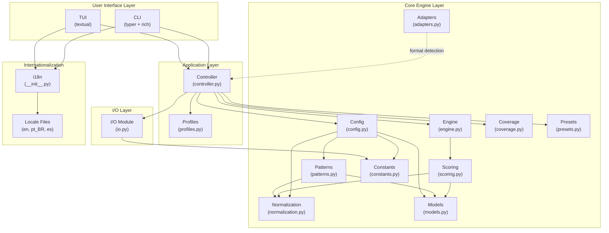
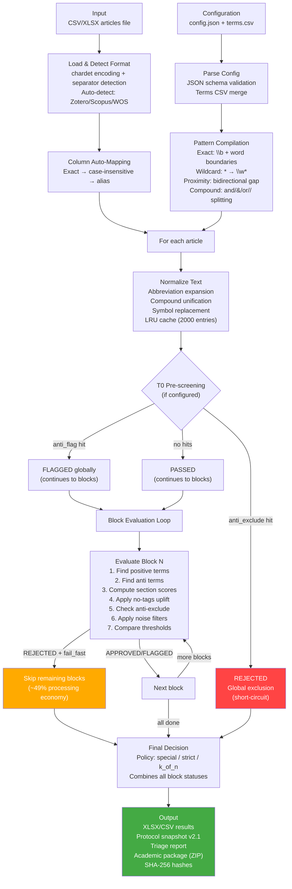
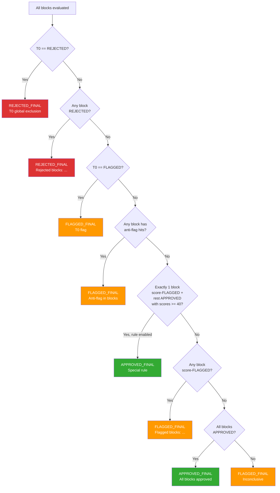

# FastSLR v3.0.0 — Technical Report

> **Document type:** Technical-executive reference
> **Audience:** Thesis committee, peer reviewers, developers
> **Version:** 3.0.0
> **Date:** March 2026

---

## Table of Contents

1. [Executive Summary](#1-executive-summary)
2. [System Architecture](#2-system-architecture)
3. [Pipeline](#3-pipeline)
4. [Algorithm](#4-algorithm)
5. [Configuration System](#5-configuration-system)
6. [Reproducibility and Audit Trail](#6-reproducibility-and-audit-trail)
7. [Quality Assurance](#7-quality-assurance)
8. [Interfaces](#8-interfaces)
- [Appendix A: Default Configuration Reference](#appendix-a-default-configuration-reference)
- [Appendix B: Complete Module API Reference](#appendix-b-complete-module-api-reference)
- [Appendix C: Decision Tree](#appendix-c-decision-tree)

---

## 1. Executive Summary

### 1.1 Problem Statement

Manual screening in Systematic Literature Reviews (SLRs) is slow, irreproducible, and subjective. A typical SLR involves hundreds to thousands of candidate articles that must be assessed against inclusion and exclusion criteria. When performed manually, this process suffers from inter-reviewer disagreement, fatigue-induced errors, and an inability to guarantee that two reviewers applying the same criteria to the same corpus will produce identical results.

### 1.2 Solution

FastSLR is a **deterministic triage engine** for SLR screening based on configurable, multi-block pattern matching. It evaluates each article's title, abstract, and manual tags against a structured set of search terms organized into thematic domain blocks, computes weighted relevance scores, and produces a final decision (APPROVED, FLAGGED, or REJECTED) through a transparent, auditable decision tree.

### 1.3 Design Philosophy: No AI/ML

FastSLR makes a **conscious, deliberate design decision** to use zero AI or ML components. This is not a limitation — it is a trade-off that yields three critical properties for academic research:

- **Transparency:** Every decision can be traced to specific term matches, section scores, and threshold comparisons. There are no opaque model weights or stochastic inference steps.
- **Determinism:** Given identical inputs (articles, configuration, terms), the engine produces bit-for-bit identical outputs every time, on any platform, without exception.
- **Full reproducibility:** Any researcher can reproduce the exact results by using the same configuration files and input data. The protocol snapshot captures everything needed.

### 1.4 Demonstrated Results

FastSLR was validated on a real SLR studying *Artificial Intelligence in Oil & Gas Supply Chain Management* (Protocol v12, January 2026):

| Metric | Value |
|--------|-------|
| Articles processed | 505 unique (from 2,519 raw hits across 4 databases) |
| Processing time | 6.91 seconds |
| Processing rate | 73.0 articles/second |
| Final corpus | 38 articles (7.5% inclusion rate) |
| APPROVED_FINAL | 43 (8.5%) |
| FLAGGED_FINAL | 147 (29.1%) |
| REJECTED_FINAL | 315 (62.4%) |
| Fail-fast economy | ~49% of articles did not require full block evaluation |
| Domain blocks | 3 (T1A: Oil & Gas, T1B: AI, T1C: SCM) |
| Configuration hash | `bf5ca7e87477fe92` |

The funnel from 505 articles to 38 final corpus entries (7.5% inclusion rate) falls within the expected range for SLRs with rigorous eligibility criteria and triple-domain intersection, confirming the precision and specificity of the triage protocol.

### 1.5 Key Numbers at a Glance

| Feature | Count |
|---------|-------|
| Dynamic domain blocks | N (user-configurable, typically 2-5) |
| Relevance levels | 5 (standard preset; also supports 1 or 3) |
| Decision policies | 3 (special, strict, k_of_n) |
| Interface languages | 3 (English, Portuguese BR, Spanish) |
| CLI commands | 10 |
| TUI screens | 10 |
| Level presets | 3 (binary, simple, standard) |
| Noise filter profiles | 3 (relaxed, balanced, strict) |

---

## 2. System Architecture

### 2.1 Layer Diagram



**Design principle:** Neither CLI nor TUI imports from `core/` directly. All orchestration passes through `controller.py`, which is the single point of contact between the application layer and the core engine. This ensures that both interfaces share identical logic and that the core engine remains interface-agnostic.

### 2.2 Module Map

| Module | File | Lines | Responsibility |
|--------|------|------:|----------------|
| `scoring` | `core/scoring.py` | 548 | Term matching, block evaluation, T0 pre-screening, final decision tree |
| `engine` | `core/engine.py` | 324 | Article processing pipeline, statistics collection, column auto-mapping |
| `patterns` | `core/patterns.py` | 245 | Pattern compilation (exact, wildcard, proximity), compound term detection |
| `normalization` | `core/normalization.py` | 128 | Text normalization engine with LRU cache (abbreviations, compounds, symbols) |
| `models` | `core/models.py` | 194 | Data classes: `GlobalParams`, `BlockEvaluation`, `T0Evaluation`, `TermMatch`, `AntiHit` |
| `config` | `core/config.py` | 333 | Config loading, JSON schema validation, terms CSV parsing, parameter construction |
| `io` | `core/io.py` | 746 | CSV/XLSX I/O, export, highlighting, reports, protocol snapshots, academic packages |
| `adapters` | `core/adapters.py` | 184 | Bibliographic format detection (Zotero, Scopus, WOS) and column mapping |
| `coverage` | `core/coverage.py` | 243 | Term coverage analysis: dead terms, broad terms, block discrimination |
| `constants` | `core/constants.py` | 64 | Version, default thresholds, valid values, section names |
| `presets` | `core/presets.py` | 160 | Level presets (binary/simple/standard), config generation |
| `cli` | `app/cli.py` | 439 | 10 CLI commands via typer with rich output |
| `tui` | `app/tui.py` | 870 | 10 interactive TUI screens via textual |
| `controller` | `app/controller.py` | 679 | Orchestration: run_triage, preview, coverage, diff, project creation, export |
| `profiles` | `app/profiles.py` | 110 | Profile save/load/list/delete (~/.fastslr/profiles/) |
| `i18n` | `i18n/__init__.py` | 130 | Locale detection, JSON-based translation, fallback chain |
| **Total** | | **5,397** | |

### 2.3 Technology Stack

| Dependency | Version | Purpose | Rationale |
|------------|---------|---------|-----------|
| **Python** | >= 3.10 | Runtime | Requires `match` statements, `X \| Y` union types, `ParamSpec`. Python 3.10 is the oldest version still receiving security updates as of 2026. |
| **pandas** | >= 2.0 | Data manipulation | Industry-standard DataFrame library. Handles CSV/XLSX I/O, column operations, and statistics efficiently. Essential for the tabular article data model. |
| **openpyxl** | >= 3.1 | XLSX export | Required by pandas for `.xlsx` write support. Chosen over `xlsxwriter` for read+write capability. |
| **typer** | >= 0.12 | CLI framework | Modern CLI framework built on click. Provides type-annotated commands, automatic `--help`, and shell completion with minimal boilerplate. |
| **rich** | >= 13.0 | Terminal formatting | Powers progress bars, styled tables, and colored output in the CLI. Dependency of both typer and textual. |
| **textual** | >= 0.80 | TUI framework | CSS-styled terminal UI framework. Supports DataTables, Input fields, RadioSets, and threaded background work — essential for the 10-screen interactive interface. |
| **jsonschema** | >= 4.20 | Config validation | Validates configuration files against the bundled JSON Schema at load time. Catches errors before processing. |
| **chardet** | >= 5.0 *(optional)* | Encoding detection | Detects CSV file encoding automatically. Gracefully degrades to UTF-8 when not installed. |

**Development dependencies** (not required at runtime): `pytest`, `pytest-cov`, `ruff`, `pyright`, `coverage`.

### 2.4 Design Decisions

The following 12 design decisions were made during the v3.0.0 development and are recorded in the project decision log:

| # | Decision | Alternatives Considered | Rationale |
|---|----------|------------------------|-----------|
| 1 | **Remove all AI/ML components** | Keep as optional, move to separate repo | System must be 100% mechanical for academic publication. Determinism and transparency are non-negotiable. Git history preserves the removed code. |
| 2 | **Dual interaction model (CLI + TUI)** | Batch only (legacy), TUI only | Researchers have different preferences. CLI enables scripting and reproducibility; TUI enables guided use for non-programmers. |
| 3 | **Hybrid architecture (v2.0 engine + new shell)** | Incremental refactor, full rewrite | The engine is tested and correct. Risk resides in the application shell, not the algorithm. Clear layer separation enables independent evolution. |
| 4 | **English interface with i18n** | English only, full i18n including output | International audience needs translated interface. Output data stays English to ensure reproducibility across locales. |
| 5 | **All 10 TUI screens** | Subset / phased release | Complete tool for publication. Each screen serves a distinct research workflow need. |
| 6 | **Cross-platform distribution via pip** | Windows-only `.bat` (legacy), conda, Docker | `pip install fastslr` is the most accessible distribution for academia. Python >= 3.10 on Windows/macOS/Linux. |
| 7 | **Pragmatic dependencies** | Minimal (stdlib only), heavy (Django/Flask) | pandas, openpyxl, typer, rich, textual are established libraries with reasonable install size and good cross-platform support. |
| 8 | **MIT License** | Apache 2.0, GPL v3 | Most permissive, standard in academic tools, minimizes adoption barriers for research use. |
| 9 | **UX designed for non-programmers** | Developer-focused CLI | Target users are researchers from diverse fields (management, engineering, health sciences), most of whom are not programmers. TUI uses plain language, contextual help, and friendly errors. |
| 10 | **Version 3.0.0** | v2.1, v2.5 | Breaking changes: removed AI layer, new application shell, restructured modules. Warrants a major version bump per semver. |
| 11 | **Pyright standard + ruff + stress tests** | Basic testing only | Academic publication demands robustness. Pyright standard mode catches type errors. Ruff enforces consistent formatting and linting. Stress tests with an auditable log document resilience. |
| 12 | **Remove legacy/ directory** | Keep as reference | Superseded by the universal v2.0-to-v3.0 engine. Git history preserves it for archaeology. |

---

## 3. Pipeline

### 3.1 End-to-End Flowchart



### 3.2 Input Stage

#### Supported Formats

FastSLR accepts CSV and XLSX files. The minimum required columns are an identifier, a title, and an abstract. Manual tags are optional but improve scoring accuracy.

#### Auto-Detection of Bibliographic Formats

The `adapters.py` module detects the export format by matching DataFrame column names against known signature sets:

| Format | Signature Columns | Column Mapping |
|--------|-------------------|----------------|
| **Zotero** | `Key`, `Item Type`, `Abstract Note`, `Manual Tags` | id=`Key`, title=`Title`, abstract=`Abstract Note`, tags=`Manual Tags` |
| **Scopus** | `EID`, `Source title`, `Cited by`, `Abstract` | id=`EID`, title=`Title`, abstract=`Abstract`, tags=`Author Keywords` |
| **Web of Science** | `UT`, `TI`, `AB`, `SO` | id=`UT`, title=`TI`, abstract=`AB`, tags=`DE` |

Detection requires at least 2 matching signature columns. The format with the most overlapping columns wins.

#### Encoding Detection

When the optional `chardet` package is installed, the first 10,000 bytes of the input file are sampled to detect encoding. Without `chardet`, UTF-8 is assumed. Separator detection tries semicolon, comma, and tab in order, accepting the first result that produces at least 3 columns.

#### Column Auto-Mapping

The engine resolves configured column names to actual DataFrame columns through a three-step fallback:

1. **Exact match** — the configured name exists as-is in the DataFrame
2. **Case-insensitive match** — e.g., `"title"` matches `"Title"`
3. **Known aliases** — e.g., `"abstract"` maps to `"Abstract Note"` (Zotero)

Built-in aliases:

| Internal name | Known aliases |
|--------------|---------------|
| `key` | `Key`, `key`, `ID`, `id` |
| `title` | `Title`, `title` |
| `abstract` | `Abstract Note`, `abstract`, `Abstract` |
| `manual_tags` | `Manual Tags`, `manual_tags`, `Tags` |

### 3.3 Pre-processing: Normalization

The `NormalizationEngine` applies a deterministic sequence of text transformations:

1. **Abbreviation expansion** — word-boundary replacement of known abbreviations (e.g., `"AI"` → `"artificial intelligence"`)
2. **Lowercasing** — after abbreviation expansion to preserve case-sensitive abbreviation matching
3. **Symbol replacement** — character-level substitutions (e.g., `"&"` → `"and"`). Alphanumeric symbols use word boundaries; punctuation symbols use literal replacement.
4. **Compound variant unification** — word-boundary replacement of compound variants to canonical forms (e.g., `"supply-chain"` → `"supply chain"`)
5. **Whitespace collapse** — all runs of whitespace reduced to a single space, trimmed

**LRU Cache:** Each `NormalizationEngine` instance maintains an LRU cache of 2,000 entries. Since many articles share similar text patterns (especially in tags), caching avoids redundant regex operations. The cache is keyed on the raw input string and evicts the oldest entry when full.

**Normalization rules** can be defined in the terms CSV via `normalization_type` and `normalization_target` columns. Supported types: `abbreviation`, `compound_variant`, `symbol_replacement`. Rules are extracted by `extract_normalization_rules()` and activated automatically when at least one rule is found (`enabled = True`).

When normalization is disabled (no rules provided), the fallback is simple lowercasing and whitespace collapse.

### 3.4 Processing Stage

#### Article Loop

The `process_articles()` function iterates over every row in the input DataFrame. For each article:

1. Extract and clean `id`, `title`, `abstract`, and `manual_tags` fields (handling `NaN`, `None`, `null` values)
2. Run T0 global pre-screening
3. If T0 rejects, mark all domain blocks as `NOT_EVALUATED` (reason: "Global T0 exclusion")
4. Otherwise, evaluate each domain block sequentially
5. Compute the final decision via `make_final_decision()`
6. Build the output row with highlighted text, per-block scores, and the verdict

#### Fail-Fast Behavior

When `FAIL_FAST_GLOBAL` is `true` (default), if any domain block returns `REJECTED`, all subsequent blocks are marked `NOT_EVALUATED` with reason "Previous block rejected". This is methodologically sound because all domain blocks are mandatory by design — if an article fails any block, it cannot pass the overall triage.

**Measured impact:** In the demonstrated real-world SLR (505 articles, 3 blocks), fail-fast produced ~49% processing economy:
- 36.6% of articles were rejected at T1A (first block) — T1B and T1C skipped
- 37.0% of articles were `NOT_EVALUATED` at T1B (fail-fast from T1A)
- 49.1% of articles were `NOT_EVALUATED` at T1C (cumulative fail-fast)

#### Error Policies

| Policy | Behavior |
|--------|----------|
| `flag` (default) | Processing errors are caught per-article. The article is marked `FLAGGED_FINAL` with reason `"Processing error: {details}"`. Processing continues. |
| `fail` | The first processing error raises an exception, halting the entire run. |

The `MAX_ERROR_RATE` parameter (default: 0.05) provides an additional safeguard but is checked at the application layer.

### 3.5 Output Stage

#### Exported Artifacts

A full triage run produces the following artifacts in the output directory:

| Artifact | Format | Contents |
|----------|--------|----------|
| `triage_results.xlsx` | XLSX | One row per article: ID, highlighted title/abstract/tags, per-block raw scores, final scores, best levels, statuses, highlight details, anti-highlights, flags, final decision, reason, version, timestamp |
| `triage_report.txt` | Text | Human-readable summary: version, date, total articles, processing time, rate, config hash, decision distribution, per-block performance |
| `protocol.json` | JSON | Protocol snapshot v2.1 (see Section 6.1) |
| `academic_report.md` | Markdown | Academic compliance report: configuration summary, scoring criteria, processing metrics, input hashes |
| `config_audit.json` | JSON | Sanitized configuration (compiled patterns stripped) with metadata |
| `academic_package.zip` | ZIP | All above artifacts + `APPENDIX_INDEX.md` + `appendix_manifest.json` |

#### Protocol Snapshot v2.1

The protocol snapshot captures all information needed to reproduce a run:
- Schema: `rsl-triage-protocol-v2.1`
- Input file paths and SHA-256 hashes (truncated to 16 hex chars)
- Configuration hash
- Decision policy and domain block definitions
- Level scores, section weights, approval/flagging thresholds
- Processing metrics (total articles, time, rate)
- Artifact paths
- Deterministic engine flag: `true`

#### SHA-256 Hashes

File hashes are computed using SHA-256 with 8 KiB chunked reading, truncated to 16 hexadecimal characters. Configuration hashes are computed by serializing the sanitized config dict with sorted keys and compact separators.

---

## 4. Algorithm

### 4.1 Term Matching Engine

#### Exact Matching

Non-regex terms are compiled with word boundaries (`\b`) to prevent partial matches. The process:

1. Strip whitespace from the raw term
2. Escape all regex metacharacters via `re.escape()`
3. Restore wildcards: `\*` (escaped asterisk) → `\w*` (match word characters)
4. Wrap with word boundaries: `\b{escaped}\b`
5. Compile with `re.IGNORECASE`

**Example:** Term `"industr*"` becomes regex `\bindustr\w*\b`, matching "industry", "industries", "industrial", etc.

#### Wildcard Support

The `*` character in terms is treated as a wildcard matching zero or more word characters (`\w*`). This is the standard truncation convention used in bibliographic database searches and provides familiar behavior for researchers.

#### Proximity Detection

Compound terms connected by `and`, `&`, `or`, or `/` are detected by the regex:

```
^(.+?)\s+(?:and|&|or)\s+(.+)$|^(.+?)\s*/\s*(.+)$
```

For each detected compound (e.g., `"supply and demand"`), a bidirectional proximity pattern is generated:

```
\b{term_a}{gap}{term_b}\b | \b{term_b}{gap}{term_a}\b
```

Where `{gap}` = `(?:\s+\S+){0,max_gap}\s+` — allowing up to `max_gap` intervening tokens (default: 2) between the two terms, in either order.

**Parameters:**
- `MAX_GAP_BETWEEN_TERMS`: Maximum intervening tokens (default: 2)
- `TOKEN_UNIT_FOR_GAPS`: Regex defining one token (default: `\S+`)
- `ENABLE_PROXIMITY_DETECTION`: Master switch (default: `true`)

#### Pattern Compilation and Caching

All patterns are compiled once during configuration preparation (`precompile_patterns()`) and stored in the block configuration dict. This avoids recompilation during the article processing loop. The compilation step:

1. Iterates over `positives`, `anti.exclude`, and `anti.flag` entries
2. Compiles each term via `compile_pattern()` — returns `None` for invalid patterns (logged, skipped)
3. For each compiled positive, calls `detect_compound_terms()` to find `and`/`&`/`or`/`/` connectors
4. Generates proximity patterns via `compile_proximity_pattern()` for each compound pair
5. Stores proximity patterns in a separate `proximity_positives` list

### 4.2 T0 Global Pre-screening

T0 is a global gate that runs **before** any domain block evaluation. It uses only anti-terms (no positive terms or scoring).

**Purpose:** Remove articles that match global exclusion criteria (e.g., "systematic review" — a secondary study that should not be included when searching for primary studies) or flag articles that match global warning criteria, before investing computational effort in per-block evaluation.

**Logic:**

```
if T0 anti_exclude matches → REJECTED (short-circuit: no blocks evaluated)
if T0 anti_flag matches   → FLAGGED (blocks still evaluated, but final decision capped)
if no T0 hits             → PASSED (blocks evaluated normally)
```

T0 is optional. If no `T0` key exists in the configuration, T0 evaluation returns `None` and blocks are evaluated directly.

### 4.3 Block Evaluation

Each domain block is evaluated independently by `evaluate_block()`. The scoring formula is explicit and deterministic:

#### Step 1: Find Positive Terms

For each term (exact + proximity) against each section (title, abstract, manual_tags):
- If `scope` is `"any"`, search all three sections
- If `scope` is a specific section name, search only that section
- Record the term, level, section, match type, and source row for every hit

#### Step 2: Compute Section Scores

```
For each section in (title, abstract, manual_tags):
    unique_levels = {m.level for m in section_matches}
    section_raw   = sum(level_scores[L] for L in unique_levels)
    section_raw   = min(section_raw, MAX_SECTION_SCORE)        # cap at 30
    weighted      = section_raw * section_weight
```

**Critical detail:** Scoring is based on **unique levels found per section**, not individual match count. If 5 different terms all match at level 3, the level-3 score (6 points) is counted only once. This prevents term list inflation from distorting scores.

**Default level scores:**

| Level | Points | Semantic meaning |
|-------|--------|-----------------|
| 1 | 10 | Essential / exact match to the research question |
| 2 | 8 | Directly related |
| 3 | 6 | Research focus |
| 4 | 4 | Processes / methods |
| 5 | 2 | Broad context |

**Default section weights:**

| Section | Weight | Rationale |
|---------|--------|-----------|
| `title` | 2.0 | Title terms are strongest relevance signals |
| `abstract` | 1.0 | Baseline weight |
| `manual_tags` | 1.5 | Author-assigned keywords are strong signals |

**Section score cap:** `MAX_SECTION_SCORE = 30` — prevents any single section from dominating the total score even when many levels are matched.

#### Step 3: Compute Raw Score

```
raw_score = sum(weighted_score for all sections)
          = (title_section_raw * 2.0) + (abstract_section_raw * 1.0) + (tags_section_raw * 1.5)
```

#### Step 4: Apply No-Tags Uplift

```
if manual_tags is empty AND NO_TAGS_UPLIFT > 1.0 AND raw_score > 0:
    final_score = raw_score * NO_TAGS_UPLIFT    # default: 1.17
else:
    final_score = raw_score
```

**Rationale:** Articles without manual tags miss one scoring opportunity. The 17% uplift compensates for this structural disadvantage without falsely promoting zero-relevance articles (the `raw_score > 0` guard).

Empty tags are detected by checking for empty string, or string values `"nan"`, `"none"`, `"null"` (case-insensitive).

#### Step 5: Anti-Exclusion Check

```
if any anti_exclude term matches:
    → REJECTED immediately
    reason: "Anti-exclusion: {term}"
```

Anti-exclusion is checked **after** scoring so that the score is available in the output for diagnostic purposes, but it **overrides** any positive score — a single anti-exclude hit causes immediate rejection.

#### Step 6: Noise Filters

Noise filters are active when `NOISE_PROFILE` is not `"relaxed"`. They prevent false positives from minimal or weak matches:

| Filter | Parameter | Default | Effect |
|--------|-----------|---------|--------|
| Minimum unique terms | `MIN_UNIQUE_TERMS_FOR_APPROVAL` | 1 | Reject if fewer distinct terms matched |
| Minimum sections with hits | `MIN_SECTIONS_WITH_HITS_FOR_APPROVAL` | 1 | Reject if hits appear in fewer sections |
| Require non-weak term | `REQUIRE_NON_WEAK_TERM_FOR_APPROVAL` | `false` | Reject if only weak-level terms found (default weak: level 5) |

#### Step 7: Threshold Comparison

```
if best_level has approval_threshold AND final_score >= approval_threshold:
    status = APPROVED
elif final_score >= flagging_threshold:
    status = FLAGGED
else:
    status = REJECTED
```

Where `best_level` = `min(found_levels)` (lowest number = highest priority).

**Anti-flag downgrade:** If the block would be `APPROVED` but anti-flag terms were found:

```
if anti_flag hits AND status == APPROVED:
    status = FLAGGED
    reason = "Downgraded to flagged: anti-flag term '{term}'"
```

### 4.4 Decision Thresholds

#### Approval Thresholds (default — standard preset)

| Best Level | Approval Threshold | Interpretation |
|------------|-------------------|----------------|
| 1 | 10.0 | Essential terms: low bar (high-confidence match) |
| 2 | 12.0 | Direct terms: moderate bar |
| 3 | 18.0 | Focus terms: higher bar (need more corroboration) |
| 4 | 22.0 | Process terms: high bar (low specificity) |
| 5 | `null` (None) | **No approval possible** — too generic to approve on its own |

**Why level 5 has no approval threshold:** Level 5 terms (e.g., "industry 4.0", "cost optimization") are so generic that matching them alone should never directly approve an article. They can contribute to score and trigger flagging for manual review, but approval requires at least one more specific term.

#### Flagging Thresholds (default — standard preset)

| Best Level | Flagging Threshold |
|------------|-------------------|
| 1 | 6.0 |
| 2 | 6.0 |
| 3 | 6.0 |
| 4 | 7.0 |
| 5 | 12.0 |

Level 5 requires a higher flagging threshold (12.0) to compensate for the generic nature of its terms — the article must accumulate substantial evidence from multiple sections to merit even a flag.

#### How best_level Interacts with Thresholds

The `best_level` is the **lowest** (most specific) level number among all matched terms. The approval and flagging thresholds looked up correspond to this best level. This means:

- An article matching a level-1 term needs only 10.0 points for approval
- An article matching only level-4 terms needs 22.0 points for approval
- An article matching only level-5 terms cannot be approved regardless of score

### 4.5 Final Decision Logic

The final decision combines all block evaluations and the T0 result into a single verdict. Three policies are available:

#### Policy: "special" (default)

This is the original v11 decision logic, designed for the multi-block SLR use case:



**Priority rules (evaluated in order):**

| Priority | Condition | Result |
|----------|-----------|--------|
| 1 | Any domain block has status `REJECTED` | `REJECTED_FINAL` |
| 2 | T0 == `FLAGGED` | `FLAGGED_FINAL` |
| 3 | Any block has anti-flag hits (regardless of score status) | `FLAGGED_FINAL` |
| 4 | Exactly 1 block `FLAGGED` by score (no anti-flags) + all others `APPROVED` with scores >= `SPECIAL_APPROVAL_THRESHOLD` (40.0) | `APPROVED_FINAL` (special rule) |
| 5 | Any block `FLAGGED` by score (no anti-flags) | `FLAGGED_FINAL` |
| 6 | All blocks `APPROVED` | `APPROVED_FINAL` |

**Special approval rule (Priority 4):** This rule recognizes that when one block is marginally below its approval threshold (flagged) but all other blocks show very strong approval (scores >= 40), the article is likely relevant. The rule requires `ENABLE_SPECIAL_APPROVAL_RULE = true` (default) and `SPECIAL_APPROVAL_THRESHOLD = 40.0` (default).

#### Policy: "strict"

AND logic — **all** blocks must be approved for the article to be approved:

```
if all blocks APPROVED       → APPROVED_FINAL
elif any blocks FLAGGED      → FLAGGED_FINAL
else                         → REJECTED_FINAL
```

#### Policy: "k_of_n"

Parametric — requires at least K approved blocks out of N:

```
if approved_count >= MIN_APPROVED_BLOCKS
   AND flagged_count <= MAX_FLAGGED_BLOCKS_FOR_APPROVAL:
    → APPROVED_FINAL
elif any blocks flagged or approved:
    → FLAGGED_FINAL
else:
    → REJECTED_FINAL
```

Parameters: `MIN_APPROVED_BLOCKS` (default: `null` → 1), `MAX_FLAGGED_BLOCKS_FOR_APPROVAL` (default: 0).

### 4.6 Fail-Fast: Methodological Justification

Fail-fast stops evaluating remaining blocks after the first `REJECTED` result. This is safe because under the "special" policy (and also "strict"), **any single block rejection causes final rejection**. Therefore:

- The final decision is identical with or without fail-fast
- Remaining blocks would be marked `REJECTED` or `NOT_EVALUATED` either way
- The only effect is computational: skipped blocks are marked `NOT_EVALUATED` instead of being fully scored

**Measured impact from the real SLR (505 articles, 3 blocks):**

| Block | NOT_EVALUATED count | Percentage |
|-------|--------------------|-----------|
| T1A (Context) | 2 (T0 exclusions only) | 0.4% |
| T1B (AI) | 187 | 37.0% |
| T1C (SCM) | 248 | 49.1% |

**Total processing economy:** ~49% of block evaluations were skipped. The blocks most likely to reject (Context, the most specific domain) are evaluated first via `BLOCK_ORDER`, maximizing the fail-fast benefit.
